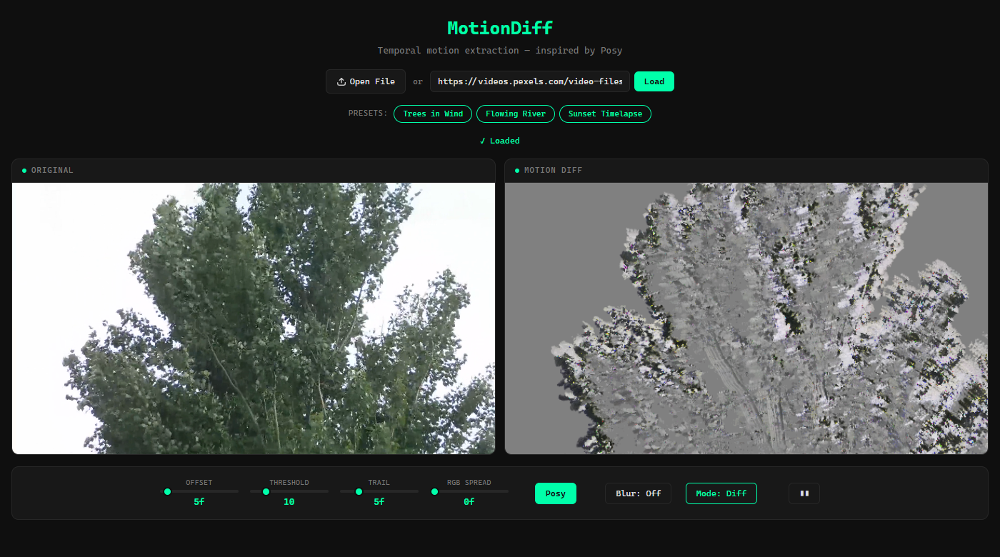
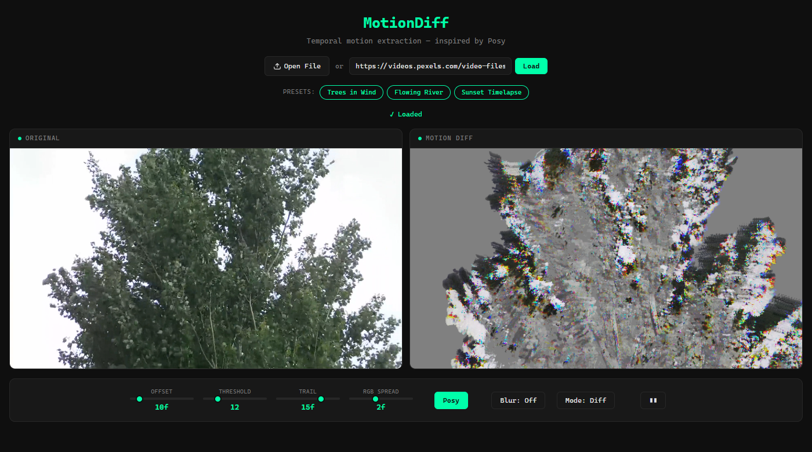
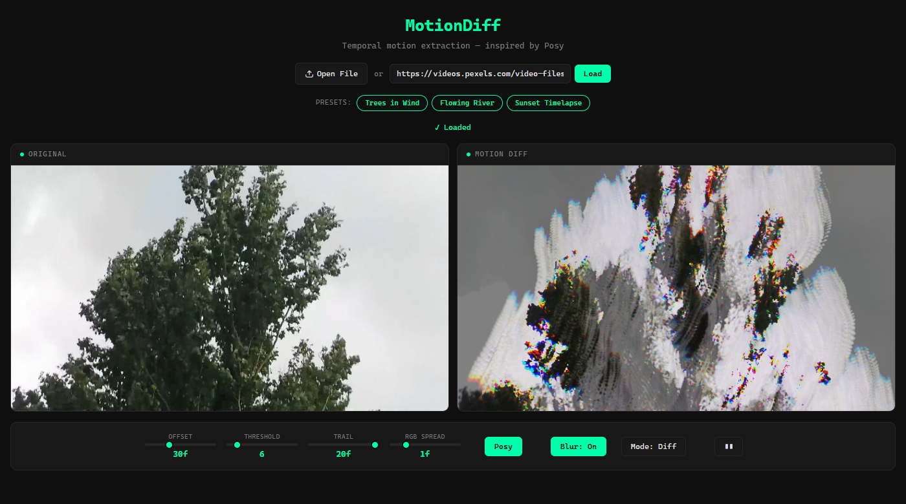
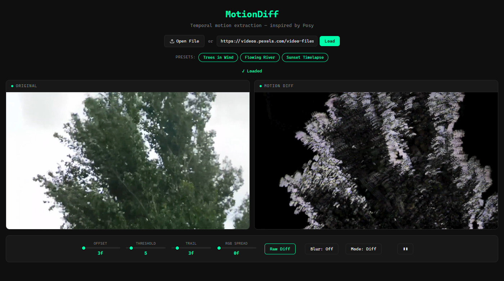

# MotionDiff Examples

## Subtle wind
Parameters: `offset=2`, `threshold=8`, `trail=8`, `spread=0`, `algorithm=Posy`, `blur=off`

Best for: grass fields, hair, fur, fabric in gentle breeze.

What to look for: fine filament-like traces on moving edges.

## Ghost trails
Parameters: `offset=10`, `threshold=12`, `trail=15`, `spread=2`, `algorithm=Posy`, `blur=off`

Best for: people walking slowly, branches swaying.

What to look for: double silhouette - one where the object was, one where it is. The RGB spread creates a rainbow smear between them.

## Atmosphere
Parameters: `offset=30`, `threshold=6`, `trail=20`, `spread=1`, `algorithm=Posy`, `blur=on`

Best for: fog, smoke, steam, distant water shimmer.

What to look for: large soft blobs of color revealing imperceptible drift.

## High contrast motion
Parameters: `offset=3`, `threshold=5`, `trail=3`, `spread=0`, `algorithm=Raw`, `blur=off`

Best for: fast motion analysis, silhouettes.

What to look for: bright white outlines on a pure black background.

